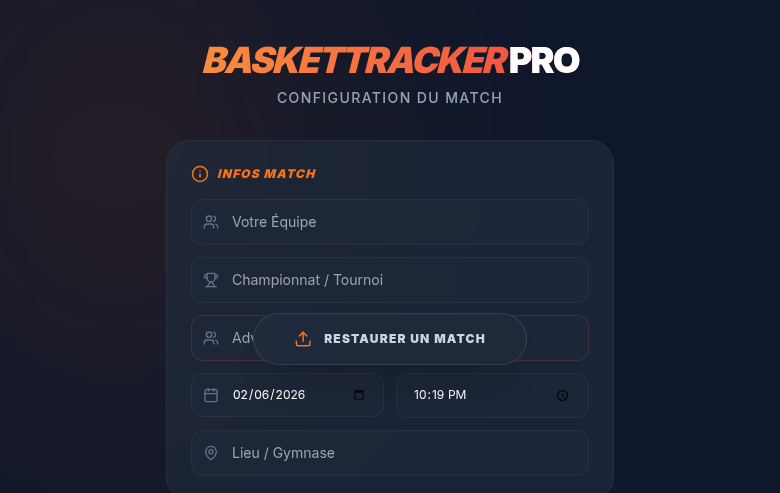
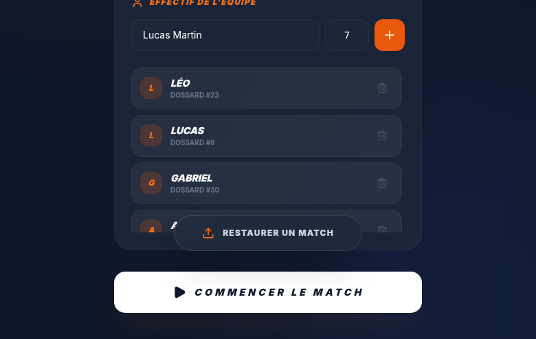
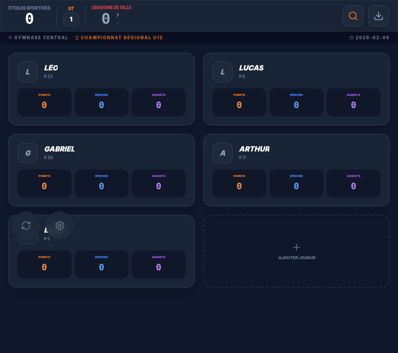
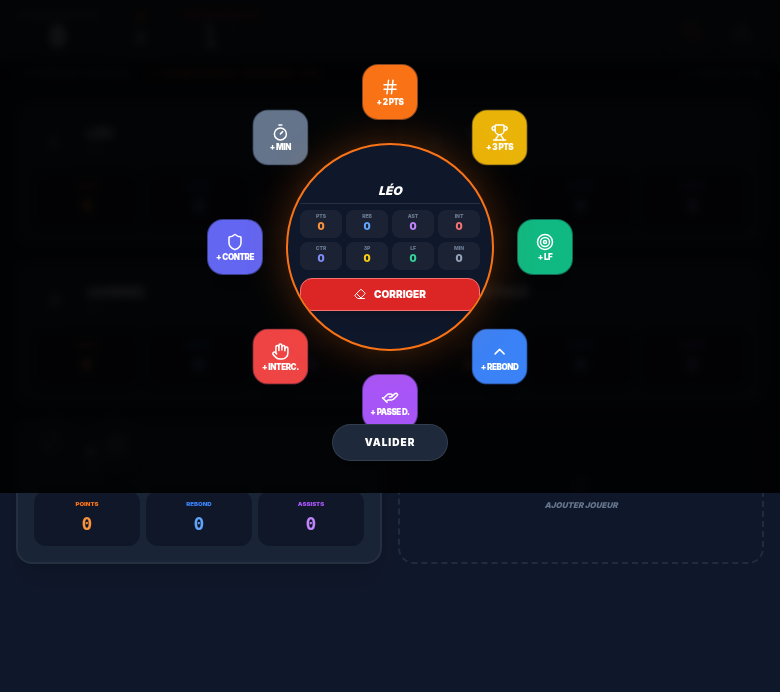

# 🏀 BasketTracker Pro

> Application de saisie de scores et statistiques pour matchs de basket — conçue pour le bord de terrain.

[](https://baskettrackerpro.vercel.app)
[](https://baskettrackerpro.vercel.app)
[](https://react.dev)

## 📱 Démo Live

**👉 [baskettrackerpro.vercel.app](https://baskettrackerpro.vercel.app)**

---

## 📸 Screenshots

<table>
  <tr>
    <td align="center"><b>Configuration</b></td>
    <td align="center"><b>Effectif</b></td>
  </tr>
  <tr>
    <td></td>
    <td></td>
  </tr>
  <tr>
    <td align="center"><b>Match en cours</b></td>
    <td align="center"><b>Saisie stats joueur</b></td>
  </tr>
  <tr>
    <td></td>
    <td></td>
  </tr>
</table>

---

## ✨ Fonctionnalités

### 🎯 Saisie Match
- Configuration équipe, adversaire, championnat, lieu
- Gestion des quart-temps
- Score en temps réel

### 👥 Gestion Effectif
- Ajout de joueurs avec nom et numéro
- Match démo pré-configuré pour tester

### 📊 Stats Individuelles
- **Interface radiale** optimisée pour le tactile
- Points (2pts, 3pts, lancers francs)
- Rebonds, passes décisives
- Interceptions, contres
- Minutes jouées
- Fonction "Corriger" pour annuler

### 📱 PWA & Offline
- Installable sur mobile (Add to Home Screen)
- Fonctionne sans connexion internet
- Cache intelligent avec mise à jour en arrière-plan

---

## 🚀 Installation

### Prérequis
- Node.js 18+

### Lancer en local

```bash
# Cloner le repo
git clone https://github.com/AliHmaou/baskettrackerpro.git
cd baskettrackerpro

# Installer les dépendances
npm install

# (Optionnel) Configurer l'API Gemini
echo "GEMINI_API_KEY=your_key" > .env.local

# Lancer le serveur de dev
npm run dev
```

L'app sera disponible sur `http://localhost:3000`

### Build Production

```bash
npm run build
npm run preview
```

---

## 🛠️ Stack Technique

| Tech | Usage |
|------|-------|
| React 19 | UI Framework |
| TypeScript | Type Safety |
| Vite | Build Tool |
| Tailwind CSS | Styling |
| Recharts | Graphiques stats |
| Gemini API | IA (optionnel) |

---

## 🗺️ Roadmap

- [x] Saisie de scores en match
- [x] Stats individuelles par joueur
- [x] Mode offline (PWA)
- [ ] Export PDF/CSV des stats
- [ ] Historique des matchs
- [ ] Intégration données FFBB
- [ ] Mode multi-utilisateurs

---

## 🤝 Contribuer

1. Fork le projet
2. Créer une branche (`git checkout -b feature/ma-feature`)
3. Commit (`git commit -m 'feat: ma feature'`)
4. Push (`git push origin feature/ma-feature`)
5. Ouvrir une Pull Request

---

## 📄 Licence

MIT — Utilisation libre, même pour usage commercial.

---

<div align="center">
  <sub>Built with 🏀 by <a href="https://github.com/AliHmaou">AliHmaou</a> & <a href="https://github.com/clawdlehomard">Clawd</a></sub>
</div>
